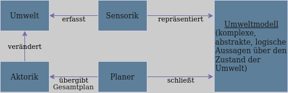
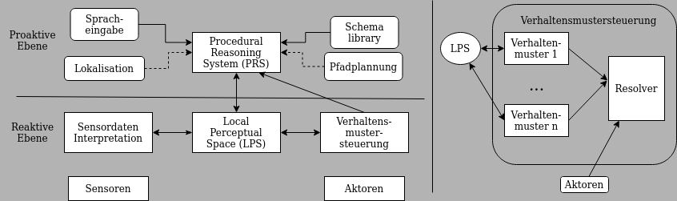

# 3. Softwarearchitekturen

## 3.1 Direktsteuerung
Regelungstechnik/Signalvorbereitungstechnischer Ansatz

|<u>Sensorik</u>|<u>Programm  Direktsteuerung</u>|<u>Aktorik</u>|
| --- | --- | --- |
| Befehle zur Umwelterfassung | -> Zyklischer Aufruf von  Sensor- und Aktorbefehlen -> | Lokomotions- und  Manipulationsbefehlen |

Diese Vorgehensweise hat Vor- und Nachteile 
Nachteil: Echtzeit benötigt. 
Vorteil: Einfach zu implementieren

## 3.2 Sense-Plan-Act
60 / 70er Jahre, Nilsson

## 3.3 Subsumptionsarchitektur
Brooks, MIT, 1986  
Frage: Warum kann ein Wurm mit seinem relativ kleinen Gehirn (Fadenwurm 302 Neuronen) in Echtzeit reagieren?

<u>Idee:</u>
Elementare Verhaltensmuster bilden die Grundsteine für Intelligenz.  
<u>Beispiel</u>:  
- Erkundungsverhalten
- Hindernisvermeidung
- Nahrungsaufnahme 

Verhaltensmuster (Behaviors) haben unterschiedliche Komplexität. Jedes Verhaltensmuster ist eigenständig funktionsfähig. Niedere Schichten unterdrücken höhere.  

## 3.4 Saphira
Konolidge, SRI, 1999   

- Verhaltensmuster berechnen gewünschte Aktorvorgaben, Resolver verknüpft die Wünsche der Verhaltensmuster zu konkreten Steuerbefehlen
- PRS verwendet Schemata von Aktivitäten der Schema Library. Jedes Schema ist ein parametrierbarer endlicher Automat
- THI RobCon ist eine einfache Implementierung der Direktsteuerung und Saphira in Java
