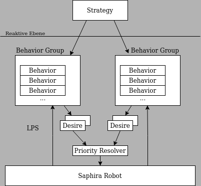
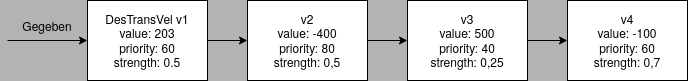
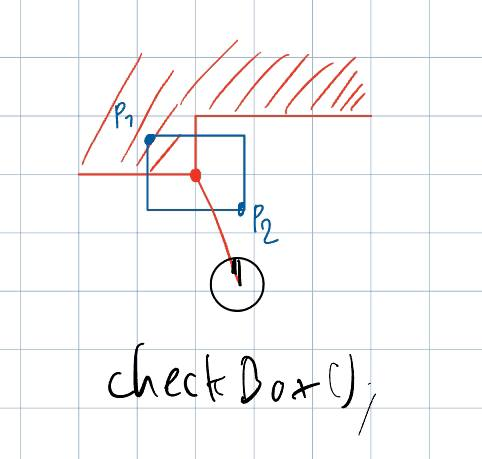
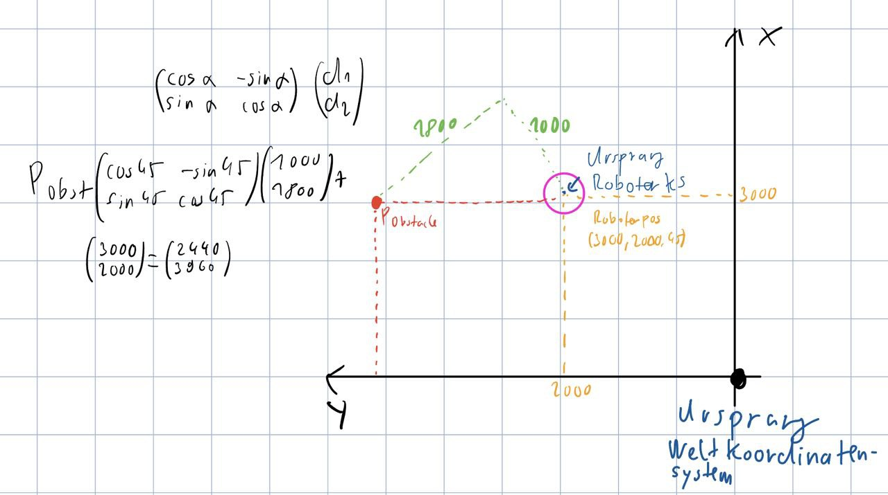

# 5 Objektorientierte Programmierung IAS
# 5.1 Programmierprinzip
Grundlage: THI RobCon mit Saphira-Architektur<br>
Proaktive Ebene: Endlicher Automat<br>
Reaktive Ebene: Verhaltensmuster mit Resolvierung<br>

## Basisklassen:<br>
 

## Ausgewählte Methoden Basisklassen
### Saphira Robot
| Methode | Beschreibung |
| --- | --- |
` Pose getPose() ` | Positionskoordinaten Fahrzeug (x,y,th) <br>
` double getTransVel() `<br>`double getRotVel()`| aktuelle Geschwindigkeiten Fahrzeug
`int getSonarRange(int n)`| Entfernungsmessung Sonar n in mm bezogen auf Fahrzeugmittelpunkt, maximal 3 m
`int getRadius()`| Abfrage Roboterradius

### Behaviour
Virtuelle Oberklasse Verhaltensmuster mit abstrakter Methode fire(), wird vom Resolver zykklisch alle 100ms aufgerufen <br>
Erzeugen Instanzen von Unterklassen der Oberklasse Desire für den Priority Resolver als Aktionsvorschläge <br>

### Unterklassen von Desire
`DesTransVel, DesRotVel` Wünsche für Geschwindigkeiten <br>
`DesCamPan, DesCamTilt ` -=- Kamerabewegungen <br>
`DesGrip, DesLift` -=- Manipulatorpositionen <br>


## Priority Resolver
- statische Priorität (Priotiy): gnerelle Wichtigkeit der Verhaltensmuster
  - ^einmalig als Wert [0;100] festeglegt (0<100)
- dynamische priotität (Strength): Situationsabhängig, in jedem Zyklus neu als Wert [0;1.0] festgelegt

### Algorithmus:
- Ordne Desires anch fallender Priorität der erzeugenden Verhaltensmuster
- Für alle Steuergrößen s:
```java	
{
    Desire r, c; r.value = 0; r.strength = 0;
    // Für alle Desire d, solange wie unsere resutlierende Strenght < 1 ist
    {
        {// Für alle Deisre d1, ... dn mit di.priority == d.priority
        c.value =  Summe di.value * di.strength;
        c.strength = 1/n * Summe di.strength;
        }
    r.value += c.value; r.strength += c.strength;
    }
    s = r.value / r.strength;
}
```


### Beispiel: Resolution TransVel

<!-- Image of ResolutionTransVel -->


### <u>1 Schritt:</u> Sortieren nach Priority

=> v2 , v1, v4, v3

### <u>2 Schritt:</u>

&emsp; &emsp; c.value = -200 | => r.value = -200 <br>
&emsp;c.strength = 0.5 | => r.strength = 0.5 <br>

### <u>3 Schritt:</u>

&emsp; c.value = 200 * 0.5 + (-100) *0,7 = 30 <br>
&emsp; c.strength = 1/2 * (0,5 + 0,7) = 0,6 <br>
&emsp; r.value = -200 + 30 = -170 <br>
&emsp; r.strength = 0,5 + 0,6 = 1,1 <br>

### <u>4 Schritt:</u>

&emsp; s = 170/1,1 = 154 <br>

### Strategy:
Oberklasse endlicher Automat mit abstrakter Methode plan() im 100 ms Zyklus aufgerufen. <br>
Aktivierung / Deaktivierung Automatenknoten


# 5.2 Basisverhaltensmuster

Behaviour | Beschreibung
--- | ---
BehConstTransVel<br> BehConstRotVel | Fahren mit konstanter Geschwindigkeit<br> (ohne Kollisiionsvermeidung, ohne alles)
BehLimFor<br> BehLimBack | Annähern an Hindernisse mit <br> wechselnden Geschwindigkeiten
BehCamInit | Initialisierung Kamera
BehMove <br> BehTurn | Fahre nach Odemtriedaten <br> (untersch. Geschwindigkeit Räder)

### Beispiel: Andocken
```java
package ... dock;
     ... main (...){
        ...
        BehGroup dock = .. // Schlüssel interne verwaltung, 200 mm/s
        BehConstTransVel cv = new BehConstTransVel("cv", 200);
        // spätere Bereinigung durch Garbage 
        BehLimFor lf = new BehLimFor("lf", 1000, 2000, 100);
        // stopDistance, slowDistance, slowSpeed
     }
     
     dock.add(cv, 50); // <- Statische Priorität
     dock.add(lf, 80);
     robot.add(dock);
     robot.run(); // <- start Echtzeitzyklus Resolver
```

# 5.3 Programmierung eigener Verhaltensmuster
## Beispiel: Orthogonales Andocken an eine Wand
```java
package ... rightangledock;
...            // ableiten, Oberklasse aller Verhaltensmuster
public class BehAlign extends Behaviuor {
    protected int tolerance, rotVel;
    // Konstruktor
    public BehAlign(String name, int tolerance, int rotVel){
        super(name); // konstruktor Oberklasse
        this.tolerance = tolerance;
        this.rotVel = rotVel;
    }
    // virtuell in Oberklasse
    public void fire() { 
        int leftDist = 0; int rightDist = 0;
        Pose relObstaclePose = new Pose(); 
        // Mit Sensoren explizit
        leftDist = robot.getSonarRange(3), rightDist = robot.getSonarRange(4);
        // Robot ist Rückverzeigert bei add BehGroup
        // Kurzkorrektur
        if (leftDist-rightDist > tolerance) 
            addDesire(new DesRotVel(-rotVel, 1.0));
            // Wunsch an Resolver, Wunschart, dynamische priorität
        else if(rightDist-leftDist > tolerance)
            addDesire(new DesRotVel(rotVel, 1.0));
        else 
            addDesire(new DesRotVel(0, 0.5)); // <-
                // andere Verhaltensmuster können auch den Kurs korrigieren
    }}
```

```java
public class BehStop extend ... {
    protected int stopDistance;
    public BehStop ...
    public void fire() {
        if (robot.getSonarRange(3) <= stopDistance) {
            success(), // <- Fertigmeldung an strategische Ebene
        }
    }
}

public class RDStrategy extends Strategy {
    protected BehGroup dock;
    public RDStrategy (BehGroup dock) {
        //... this.dock = dock);
        dock.activateExclusive();  // Knotenaktivierung endlicher Automat
    }
    public void plan() {
        if (dock.isSuccess()) // <- Abfrage ob BehGroup erfolgreich Fertig
            stopRunning();
    }
}

public class RDMain {
    ... main ...
    BehAlign al = new BehAlign("al", 30, 5); // tolerance, rotVel
    BehStop st = new BehStop("st", 800); // stopDistance
    ...
    dock.add(al, 75);
    dock.add(st, 80);
    robot.add(new RDStrategy(dock));
    robot.run();
}

```

# 5.4 Sensordatenverarbeitung
## 5.4.1 Odometriedaten und Koordinaten
### Standard koordinatensysteme
- ENN (East-North-Up) bei Landfahrzeugen
- NED (North-East-Down) bei Luftfahrzeugen
- 6 Basen (x,y,z) für Raumpunkt
  - (yaw, pitch, roll) für Orientierung (Euler-Winkel)
  - Drehung um jeweils z, y und x

Vereinfachung bei ENU in einer Ebene:
(Diagramm/Notability)

Auslesen Roboterposition mit getPose() als Pose <br>
- get(), set() für x,y,th
- double x.findDistanceTo(Pose y)
  - Euklidischer Abstand zwischen x und y
- double x.findAngleTo(Pose y)
  - Euklidscher Winkel zwischen x und y
- double x.diffAngleTo(Pose y)
  - Differenzwinkel Orientierungen von x und y

## 5.4.2 Entfernungsdaten
Bisher: Abfrage der Sonare einzeln und direkt

Problem: 
- Wiederverwendung Programme auf unterschiedlichen Robotern
- Entfernungsmessung nicht nur mit Sensoren

Abhilfe:<br>
a) Konfiguration Multisensorsystem<br>
b) Abfrage fusionierter Sensordaten in Regions of Interest<br>

In THIRobCon:
- robot.addLaser(); Einbindung Laserscanner in LPS
- robot.addVCC4(); Einbindung Canon PTZ-Kamera
- => später Persistentes Umfeldmodell mit Datenbank

b) <br>
b1) Auswertung Kreissegment<br>
&emsp;Methode: double checkPolar()

Beispiel: Orthogonales Andocken
```java
// Mit Kegel
leftDist = (int) (checkPolar(2,10,relObstaclePose) - robot.getRadius());

rightDist = (int) (checkPolar(-10,-2,null) - robot.getRadius());
```
b2) Auswertung Rechteck<br>
&emsp; Methode: checkBox() <br>



<br>

Beispiel: Orthogonales Andocken
```java
// Mit Box                       P1.x  p1.y p2.x p2.y
leftDist = (int) (robot.checkBox(2500, 500, 100, 100,relObstaclePose) - robot.getRadius());

rightDist = (int) (robot.checkBox(2500, -500, 100, -100, null) - robot.getRadius());
```

Eintragung P in globale Karte erfordert Koordinatentransformation aus Roboterkoordinatensystem in basis Koordinatensystem<br>

Beispiel: 2D-Koordinatentransformation<br>
Drehmatrix und Verschiebungsvektor<br>




<br>

# 5.4.2 Bilder
- Merkmalsteuerung über Farben und Kanten
- Farbbereiche durch Region Growing in Echtzeit -> ACTS
- Kantenerkennung durch Hough Transformation nicht in Echtzeit -> Halcon
- Trainieren Farbbrereiche offline zu Kanälen

Auswertung in THI RobCon:<br>
&emsp; int getNumBlock(int ch) Anzahl Blob im Kanal<br>
&emsp; Blob getBlob(int ch, int i) Auslesen Blob i zum Kanal ch in Schleife<

Auswertung eines Blob<br>
&emsp; int getxcg() (x center of gravity) Koordinaten Blobschwerpunkt <br>
&emsp; int getycg() bezogen auf Bildgröße <br>
&emsp; int getArea() Zahl Pixel im Blob <br>
&emsp; int getTop(), ... , getRight() Ausdehnung <br>

Positionierung Kamera:<br>
- BehCam Init Startuausrichtung Kamera pan und tilt (yaw und pitch)
- DesCamPan, DesCamTilt dynamisch in den Verhahltensmustern

## Beispiel: Signal Dock
```
-> start -------> find ----------> dock ----->
     |             |                |
 BehCam Init    BehRotate         BehConstTransVel BehStop
 (success)      BehFindSignal     BehLiniFor?      (success)
              (success, error)    BehAlign
```


